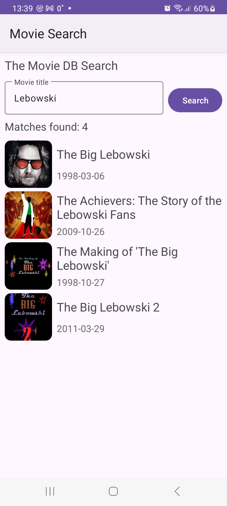
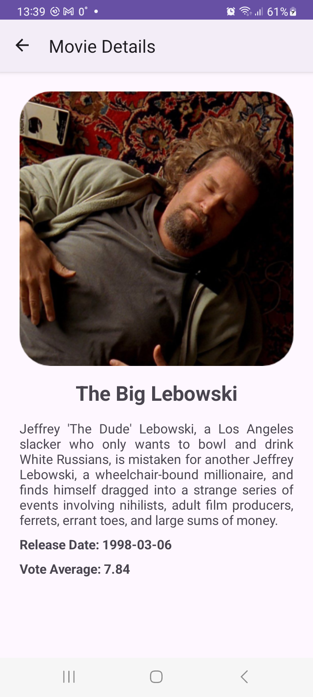

# Movies DB

- GET requests are send via **Retrofit** to the [TMDB API](https://developer.themoviedb.org/reference/intro/getting-started). All communication with the server is logged with **HttpLoggingInterceptor** 
- Requests are made inside **coroutine with viewmodelScope**.  
- Movie posters are loaded with **Coil** library. Effects like rounded corners and loading animations are applied. 
- **ViewModel** and **LiveData** are used for persistency through configuration changes and easier UI updates.

  
  

